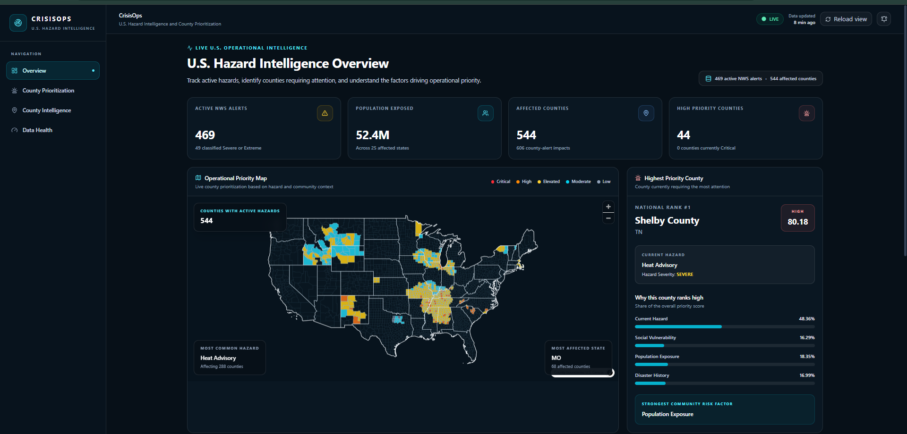
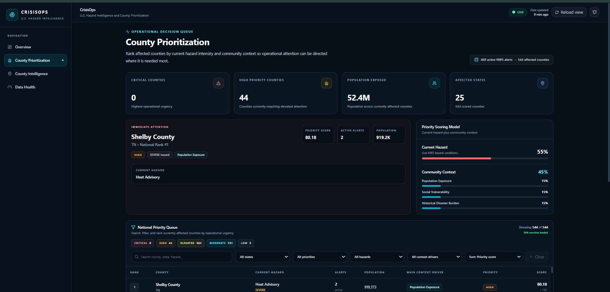
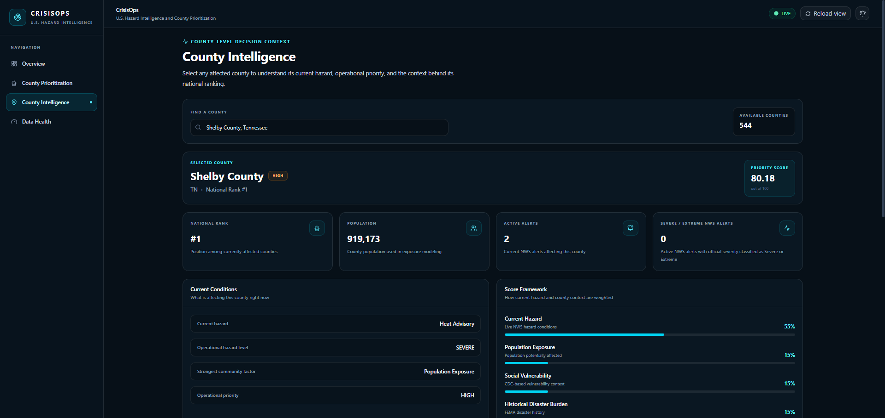
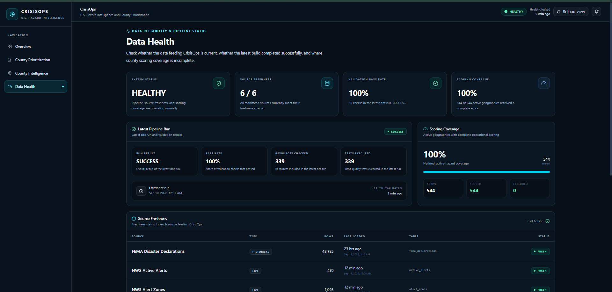

# CrisisOps AI

### Live U.S. Hazard Intelligence & County Prioritization Platform

CrisisOps is a production-style disaster intelligence platform that combines live weather hazards with population exposure, social vulnerability, and historical disaster burden to identify which U.S. counties may require the most operational attention.

**Live Application:**  
https://crisisops-web-607779483839.us-central1.run.app

---

## Why I Built This

Most disaster dashboards answer one question:

> What hazards are happening right now?

I wanted to go further and answer:

> Where should operational attention be directed first, and why?

CrisisOps combines live hazard conditions with county-level community context so that an active weather alert is not evaluated in isolation.

The platform continuously brings together:

- National Weather Service active alerts
- U.S. Census county population
- CDC Social Vulnerability Index
- FEMA historical disaster declarations
- NWS forecast-zone to county mappings

The result is a ranked national operational priority queue that updates as hazard conditions change.

---

## Live Platform

CrisisOps contains four primary decision views.

### 1. U.S. Hazard Intelligence Overview

Provides a national picture of current conditions including:

- Active NWS alerts
- Population exposed
- Affected counties
- High-priority counties
- Interactive county priority map
- Highest-priority county
- National top-priority queue
- Pipeline and data-health indicators



---

### 2. County Prioritization

Ranks every currently affected county using the CrisisOps operational scoring model.

Users can:

- Search counties
- Filter by state
- Filter by priority
- Filter by active hazard
- Filter by community risk driver
- Sort by operational priority score
- Compare population exposure and active alerts

The page is designed as an operational decision queue rather than a static dashboard.



---

### 3. County Intelligence

Provides a detailed explanation of why an individual county received its current ranking.

County-level intelligence includes:

- National rank
- Priority score
- Current NWS hazard
- Active alert count
- Population
- Social vulnerability
- Historical disaster burden
- FEMA disaster history
- Contribution of each scoring factor
- Dynamic county explanation questions

Example questions include:

- Why is this county ranked this high?
- What is driving the score the most?
- Which county-context factor matters most?
- What does FEMA history add to the score?



---

### 4. Data Health

The platform also exposes the reliability of the data powering the dashboard.

The Data Health page monitors:

- Pipeline status
- Source freshness
- dbt validation pass rate
- County scoring coverage
- Latest pipeline execution
- Data source record counts
- Coverage exceptions

This makes pipeline reliability visible instead of hiding data-quality problems behind the dashboard.



---

#```mermaid
flowchart LR

    NWS[National Weather Service]
    FEMA[FEMA]
    CENSUS[U.S. Census]
    CDC[CDC SVI]

    PY[Python Ingestion & Processing]

    BQRAW[BigQuery Raw Layer]

    DBT[dbt Transformations]

    MARTS[Analytics Marts]

    API[Next.js API Layer]

    WEB[CrisisOps Web Application]

    RUN[Google Cloud Run]

    SCHED[Cloud Scheduler]

    NWS --> PY
    FEMA --> PY
    CENSUS --> PY
    CDC --> PY

    PY --> BQRAW
    BQRAW --> DBT
    DBT --> MARTS

    MARTS --> API
    API --> WEB
    WEB --> RUN

    SCHED --> RUN
```

---

# Data Pipeline

Data Pipeline

The production pipeline follows this sequence:


External Data Sources
        ↓
Python ingestion
        ↓
Source normalization
        ↓
Geographic resolution
        ↓
BigQuery raw layer
        ↓
dbt staging models
        ↓
dbt intermediate models
        ↓
County intelligence marts
        ↓
Data quality validation
        ↓
Next.js API
        ↓
Live CrisisOps application


The automated pipeline is deployed as a Google Cloud Run Job and triggered through Google Cloud Scheduler approximately every 30 minutes.

Operational Priority Model

The CrisisOps score combines current hazard conditions with county-level context.

Component	Weight
Current Hazard	55%
Population Exposure	15%
Social Vulnerability	15%
Historical Disaster Burden	15%

The purpose of the model is not to predict disasters.

It creates a transparent operational prioritization framework for comparing counties that are currently affected by active hazards.

Each county receives:

Hazard score
Population exposure score
Social vulnerability score
Disaster history score
Operational priority score
Priority classification
National rank

Priority levels include:
CRITICAL
HIGH
ELEVATED
MODERATE
LOW


The application also exposes the individual contribution of each scoring component so the final ranking remains explainable.


Data Sources
National Weather Service

Used for live hazard intelligence including:

Active alerts
Alert severity
Alert urgency
Alert certainty
Geographic zones
Hazard type
U.S. Census Bureau

County population is used to estimate population exposure.

CDC Social Vulnerability Index

County-level SVI provides community vulnerability context.

FEMA

Historical disaster declarations provide long-term disaster burden and recurrence context.

NWS Zone-County Crosswalk

Forecast zones are resolved to U.S. counties to create a consistent county-level analytical grain.

Analytics Engineering

The transformation layer is implemented with dbt.

Major model layers include:

Staging

Source normalization and type casting.

Intermediate

Business logic including:

County context
Live county hazards
Alert-to-county resolution
FEMA county history
Zone-county mapping
Exposure calculations
Marts

Production-facing analytical models including:

County operational priority
County intelligence
National situation
Priority queue
Pipeline health
Source freshness
County alert detail
Unscored geography monitoring
Data Quality

CrisisOps includes automated validation across the transformation layer.

Checks cover areas such as:

Null keys
Duplicate county records
Referential integrity
Operational score bounds
Priority classifications
Priority queue reconciliation
Hazard severity logic
County scoring completeness

The application exposes the result of these validations through the Data Health interface.

Technology Stack
Data Engineering
Python
Pandas
Google BigQuery
dbt
Google Cloud Run Jobs
Google Cloud Scheduler
Google Cloud Build
Artifact Registry
Docker
Application
Next.js
React
TypeScript
MapLibre GL
Server-side API routes
Data Sources
National Weather Service API
FEMA
U.S. Census Bureau
CDC Social Vulnerability Index
DevOps
Git
GitHub
Google Cloud IAM
Cloud Build
Cloud Run
Repository Structure

crisisops-ai/
│
├── data/
│   ├── raw/
│   ├── processed/
│   └── reference/
│
├── ingestion/
│   ├── bigquery/
│   ├── census/
│   ├── cdc/
│   ├── fema/
│   ├── nws/
│   └── reference/
│
├── processing/
│   ├── exposure/
│   ├── geography/
│   ├── historical/
│   ├── nws/
│   ├── risk/
│   └── vulnerability/
│
├── dbt/
│   └── crisisops/
│       ├── models/
│       │   ├── staging/
│       │   ├── intermediate/
│       │   └── marts/
│       └── tests/
│
├── deployment/
│   ├── run_pipeline.py
│   ├── profiles.yml
│   └── requirements.txt
│
├── web/
│   ├── src/
│   ├── public/
│   └── package.json
│
├── docs/
│   └── screenshots/
│
├── Dockerfile.pipeline
├── cloudbuild.pipeline.yaml
└── README.md


Production Deployment

The pipeline and application are deployed independently.

Pipeline


Cloud Scheduler
      ↓
Cloud Run Job
      ↓
Python ingestion
      ↓
BigQuery
      ↓
dbt build + validation


Web Application


User
 ↓
Cloud Run
 ↓
Next.js
 ↓
Server API
 ↓
BigQuery analytical marts


Separating the pipeline from the application allows the dashboard to serve previously validated analytical data while a new ingestion cycle is running.


Reliability Design

CrisisOps includes several production-style reliability features:

Automated scheduled ingestion
Source freshness monitoring
Ingestion metadata capture
dbt run metadata
Data-quality validation
County scoring coverage monitoring
Explicit handling of unsupported geographies
Cloud Run execution monitoring
Separate raw, transformation, and application layers

Live NWS geographies that cannot be supported with the required U.S. county context are intentionally excluded from the scored county model rather than silently assigned incomplete scores.

Key Engineering Decisions
County as the Analytical Grain

Different sources use different geographic structures. CrisisOps resolves them to a common county-level grain so hazard, population, vulnerability, and historical data can be compared consistently.

Preserve Raw Source Values

The BigQuery raw layer stores source values primarily as strings. Type casting and normalization occur in dbt staging models, helping preserve geographic identifiers such as FIPS codes.

Separate Hazard From Community Context

A severe hazard does not automatically imply the same operational risk everywhere.

The scoring model therefore separates:

Current hazard conditions

from:

Population + vulnerability + historical disaster context
Make Data Health Visible

A dashboard should not appear trustworthy simply because it successfully rendered.

CrisisOps exposes freshness, pipeline execution, validation results, and scoring coverage directly in the product.

What This Project Demonstrates

CrisisOps was built to demonstrate more than visualization.

Built as an end-to-end analytics engineering and operational intelligence portfolio project.
→ geographic normalization
→ cloud warehouse
→ analytics engineering
→ data quality
→ operational scoring
→ application APIs
→ interactive visualization
→ cloud deployment
→ scheduled production refresh
→ monitoring


The goal was to build something that behaves like a small production analytics platform rather than a standalone portfolio dashboard.

Author

Likhith Yedida

Data Analyst / Analytics Engineer

Built as an end-to-end analytics engineering and operational intelligence portfolio project.